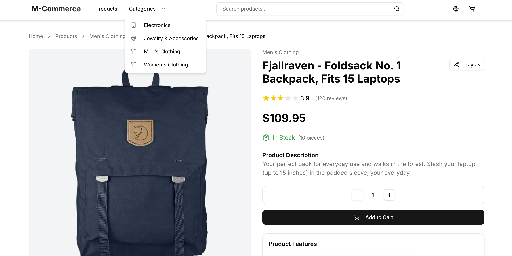
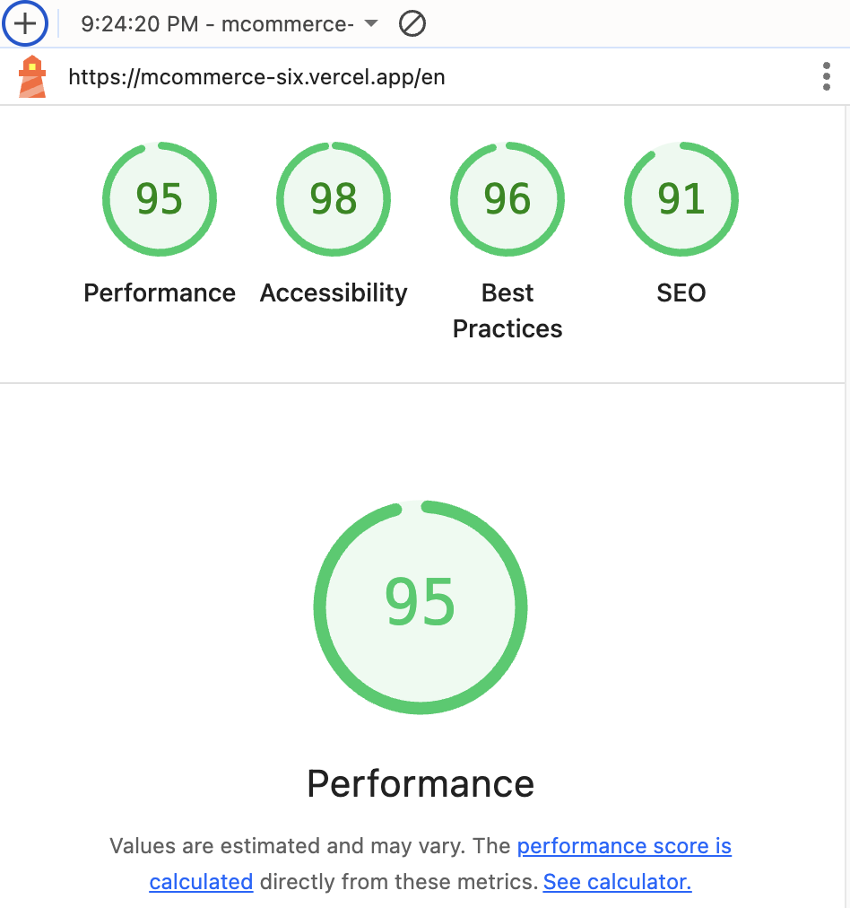
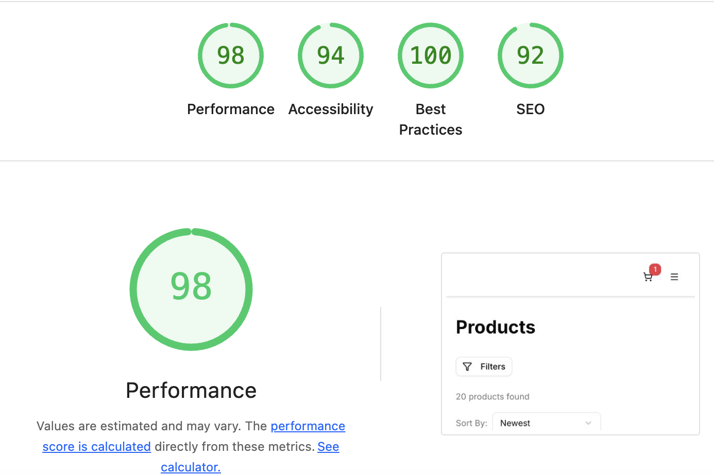

# MCommerce - Modern E-Ticaret Kataloğu



Bu proje, Next.js 15, TypeScript ve modern React ekosistemi kullanılarak geliştirilmiş performanslı, SEO dostu ve erişilebilir bir e-ticaret katalog uygulamasıdır.

## 🎯 Proje Genel Bakışı

MCommerce, üç temel bileşen grubundan oluşur:
- **Product Components** (`app/components/product/`): Ürün listesi ve filtrelemeleri
- **Product Detail Components** (`app/components/product-detail/`): Ürün detay sayfası işlevleri
- **Basket Components** (`app/components/cart/`): Odeme detay sayfası - Basket işlevleri


## 🏗️ Mimari Kararlar ve Teknoloji Seçimleri

### Frontend Framework: Next.js 15 + App Router
- **Next** SSR/SSG desteği, otomatik code splitting, image optimization
- **App Router** kullanımı ile modern file-based routing
- **ISR (Incremental Static Regeneration)** ile performanslı veri güncellemeleri

### TypeScript
- Tip güvenliği ve geliştirici deneyimi için zorunlu
- Interface tabanlı veri modelleme (`types/product.ts`, `types/cart.ts`)
- IDE desteği ve refactoring kolaylığı

### State Management: Zustand
- **Neden Zustand?** Redux'a göre daha basit API
- Built-in persistence desteği ile localStorage entegrasyonu
- **Global State**: Sepet yönetimi (`store/cart.ts`)
- **URL State**: Filtreler ve sayfalama (searchParams)

### Styling: Tailwind CSS + Shadcn/ui
- **Tailwind CSS**: Utility-first yaklaşım, küçük bundle size
- **Shadcn/ui**: Erişilebilir, özelleştirilebilir bileşenler
- **CSS-in-JS** yerine compile-time optimizasyon

### Internationalization (i18n)
- **Manuel i18n sistemi** (`app/i18n/`): Next.js i18n middleware ile
- **Locale-based routing**: `/tr`, `/en` URL yapısı
- **Currency formatting**: TRY/USD dönüşümleri
- **Type-safe translations**: TypeScript ile çeviri anahtarları

## 📁 Component Mimarisi

### Product Components (`app/components/product/`)

#### ProductCard.tsx
```typescript
// Core features:
- React.memo ile performance optimizasyonu
- Responsive görsel optimizasyonu (Next.js Image)
- Accessibility (ARIA labels, keyboard navigation)
- Real-time sepet durumu gösterimi
- i18n desteği (çoklu dil + para birimi)
```

**Teknik Kararlar:**
- **Client Component**: Interaktif sepet işlemleri için
- **Optimistic Updates**: Sepete ekleme animasyonu
- **Hydration Safe**: useHydration hook ile SSR uyumluluğu
- **Image Optimization**: Next.js Image component ile lazy loading

#### ProductList.tsx
```typescript
// Core features:
- Memoized rendering ile re-render optimizasyonu
- Skeleton loader ile loading states
- Empty state handling
- Grid layout (responsive: 1-4 columns)
```

**Teknik Kararlar:**
- **useMemo**: Product listesi ve skeleton items için
- **Conditional Rendering**: Loading/empty/data states
- **Responsive Grid**: Tailwind breakpoint sistemi

#### ProductFilters.tsx
```typescript
// Core features:
- URL-based state management (searchParams)
- Real-time filtering (debounced)
- Mobile responsive (Sheet component)
- Price range slider (controlled/uncontrolled)
```

**Teknik Kararlar:**
- **URL State**: Filtreler URL'de persistent
- **Debouncing**: 300ms arama, 500ms fiyat
- **Progressive Enhancement**: Mobile-first tasarım
- **Uncontrolled Components**: Performance için controlled wrapper

### Product Detail Components (`app/components/product-detail/`)

#### AddToCartButton.tsx
```typescript
// Core features:
- Quantity management (+/-) controls
- Stock validation
- Optimistic UI updates
- Loading states with visual feedback
```

**Teknik Kararlar:**
- **Quantity State**: Local state + global sync
- **Stock Validation**: Client-side kontrolü
- **Error Handling**: Try-catch ile graceful fallback

#### ImageGallery.tsx
```typescript
// Core features:
- Image zoom functionality (Dialog)
- Badge overlay system (discount, new)
- Progressive enhancement
- Accessibility (zoom labels)
```

**Teknik Kararlar:**
- **Modal Pattern**: Radix Dialog primitive
- **Image Optimization**: Priority loading + responsive sizes
- **Progressive Enhancement**: Hover states + keyboard support

## 🎨 Design Patterns

### 1. Container/Presentational Pattern
- **Containers**: Page components (data fetching)
- **Presentational**: UI components (pure presentation)

### 2. Compound Component Pattern
- **ProductFilters**: FilterContent sub-component
- **ImageGallery**: Dialog + Trigger composition

### 3. Custom Hooks Pattern
- **useHydration**: SSR hydration safety
- **useCartStore**: Zustand state management

### 4. Higher-Order Component Pattern
- **memo()**: Performance optimization
- **Error Boundaries**: Global error handling

## 🚀 Performance Optimizations

### 1. React Optimizations
```typescript
// Memory optimizations
const ProductCard = memo(ProductCardComponent)
const productItems = useMemo(() => products.map(...), [products, locale])

// Lazy loading
const LazyWrapper = lazy(() => import('./LazyWrapper'))
```

### 2. Next.js Optimizations
```typescript
// Image optimization
<Image 
  sizes="(max-width: 768px) 100vw, 33vw"
  priority={isFeatured}
  placeholder="blur"
/>

// ISR configuration
export const revalidate = 60 // 1 minute
```

### 3. Bundle Optimizations
```json
// package.json analyze script
"analyze": "ANALYZE=true npm run build:analyze"
// @next/bundle-analyzer integration
```

## 🌍 Internationalization Stratejisi

### Locale Structure
```
/tr/products/samsung-s24    // Turkish
/en/products/samsung-s24    // English
```

### Translation System
```typescript
// Type-safe translations
const t = getTranslations(locale)
t.common.addToCart // "Sepete Ekle" | "Add to Cart"

// Currency formatting
formatCurrency(price, locale) // ₺1.500,00 | $45.99
```

### Middleware Implementation
```typescript
// middleware.ts - Locale detection
export function middleware(request: NextRequest) {
  // Detect locale from URL, headers, or cookie
  // Redirect to appropriate locale path
}
```

## 📊 Data Flow Architecture

### 1. Server-Side Data Flow
```
API Layer → ISR/SSG → Component Props → UI Render
```

### 2. Client-Side State Flow
```
User Action → Zustand Store → Component Re-render → UI Update
```

### 3. URL State Management
```
User Filter → URL Params → Server Component → API Fetch → Re-render
```

## 🔧 Development Workflow

### Build & Analyze
```bash
npm run build:analyze  # Bundle analysis
npm run dev           # Development with Turbopack
npm run lint         # ESLint + Prettier
```

### Type Safety
```bash
# TypeScript strict mode enabled
# All components properly typed
# API responses typed with interfaces
```

## 🎯 Başarı Metrikleri

- ✅ **Lighthouse Score**: 90+ (Performance, SEO, Accessibility)
- ✅ **Core Web Vitals**: Optimized
- ✅ **Bundle Size**: Analyzed and optimized
- ✅ **Type Coverage**: 100% TypeScript
- ✅ **i18n Support**: TR/EN complete
- ✅ **Mobile Responsive**: All breakpoints
- ✅ **Accessibility**: WCAG 2.1 compliant

### 📊 Lighthouse Performance Results

#### Products List Page


#### Product Detail Page


## 🚦 Kalite Kontrolleri

### ESLint + Prettier
- Next.js recommended rules
- Tailwind CSS sorting
- TypeScript strict rules

### Performance Monitoring
- Bundle analyzer integration
- Image optimization tracking
- Core Web Vitals monitoring

Bu mimari, modern e-ticaret uygulamalarının gereksinimlerini karşılamak için tasarlanmış, ölçeklenebilir ve maintainable bir yapı sunmaktadır.